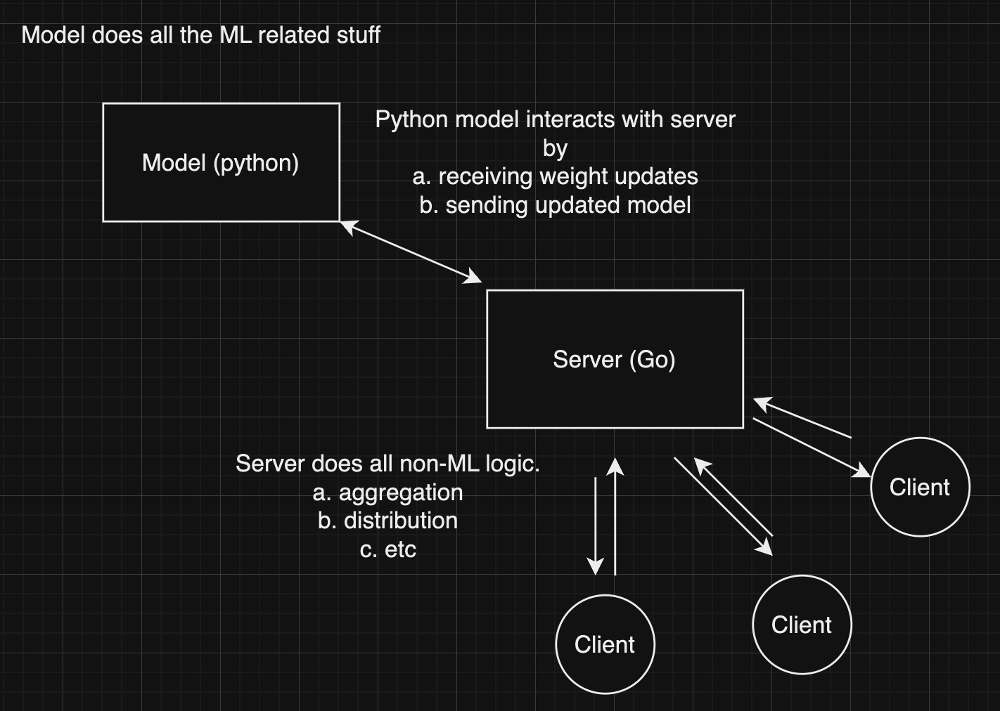

# Final Project Report

## Introduction

Our goal was to implement federated learning, a neural network training framework that enables collaborative training of a central model on client data while preserving privacy. In general, this is done by the model being sent to each device and trained on their local data. Then,  encrypted weight changes are sent back to the server and aggregated to update the model, which is then redistributed to clients.

We wanted to be able to train a simple model, e.g. MNIST, using heterogeneously distributed data around from a given number of clients, then train and evaluate model performance server-side. Our goal was to get close to the same accuracy as training the same model entirely locally, which we were able to accomplish within a reasonable margin.

## Design/Implementation

Our design consists of a Go server that communicates to both Python clients and the server's Python model through gRPC. In particular, the Python client communicates to the server by either requesting or sending model weights. When the client is initialized, it requests weights and then begins training its instantiation of the global model on its local data. Then, the new weights are sent to the server, which consumes these weights. The server periodically aggregates the clients’ weights in the background. When the weights are aggregated, the server then distributes the new model to all of its clients (for simplicity, the clients request the weights in our implementation, but going forward we will have the server distribute the weights among the clients). The client then repeats this process, which in the real world would likely involve the client obtaining new data, but in our example, each client will reuse the same data for multiple communication rounds.

We chose for the server to be in Go so that it could handle the concurrency of receiving weights and the timed action of aggregating weights. However, the server needs to be able to keep track of incoming weights and use them to aggregate a new model, which must be done in Python. Therefore, the Go server essentially acts as a middleman between the Python clients and the server's global model, which communicate indirectly through the server. The server starts by telling the Model Service to initialize the global model, then begins a ticker that periodically sends the new weights the server has received from its clients to the Model Service to aggregate the weights into a new model. 

The go server implements the following processes

`InitializeModel`: When the go server boots up, it sends a request to the model server to initialize itself. The model server then does so.

`SendWeights`: when a client wants to send their weights to the server for aggregation, the server consumes the clients’ weights and adds them to a data structure for further use

`RequestWeights`: When a client requests weights, the server then sends a request to the model service which returns the weights as a byte array. This byte array is pickled (i.e., marshaled) and then unpickled on the other side in a way that respects Python objects. This is our way of implementing weight distribution among the clients.

Weight aggregation happens periodically and works by essentially taking an average of each updated client model weighted by how much data it has. This ensures that clients with relatively few samples do not disproportionately skew the global model. (maybe some more details here). The weight aggregation happens only if 1. there are clients connected and 2. if there are over 50% of clients that have sent *new* weights that haven’t been aggregated yet.

The Python (model) server implements the following processes

`InitializeModel`: when the server receives this request, it initializes the Tensorflow model

`ModelGetWeight` : The model server will send the global weights. This is sent to the go server to then distribute among the clients

`AggregateModelWeights` : the model will take in a stream of weights and aggregate them

`TestModel` : the model will test itself out using the test data and `model.evaluate` and print the result

Networking:

Most of the networking content was in the creation of a protocol through gRPC for models and weight updates to be sent between server and client, along with the server orchestrating when training, aggregation, and testing occur.

We also used mutexes to keep the main data structures thread-safe. For example, we will have a data structure that holds the weights of each client (this will then be sent to the Python model). This data structure could be changed by both the aggregation and the weight updates at the same time and thus it needs to be thread-safe.

Finally, we will use goroutines for operations that can be run in unison for example when we want to aggregate the weights, we create a goroutine for this process.

## Discussion/Results

The global model had testing accuracies that compared to the validation accuracies of the clients despite them likely overfitting on their limited training data. We also noticed that the client validation accuracies fluctuated after server model updates, which was likely a result of the server aggregating the weights of multiple models, thus reducing the ability of a given client to overfit its data.

We tested the same architecture on the same data entirely locally for 10 epochs, and it achieved ~95% accuracy, about 3% better than the performance we recorded in the demo video. This could be due to a variety of reasons, such as the way we split our data between clients, epochs, and training/testing or shortcomings of the particular aggregation algorithm we chose.

We also noticed that adding more clients tends to increase accuracy, which we think is because the variations in each client’s model eventually average out to approximate the model that was trained entirely locally.

One challenge was deciding how to give the Go server control over a persistent global model. We considered options like saving the models to disk and making separate calls to Python processes from Go, but this presented various problems. Saving every new client model would not have scaled well, as there would be a lot of file I/O, although managing everything in memory could present its own issues for large enough models. For our minimal example, we figured it would be more efficient to instead communicate to a persistent Python process through gRPC, which would also allow us to experiment more with designing communication protocols.

As a result, we had to make several more choices about how to transfer weights between the server and its model servicer. Specifically, the server would be responsible for sending the weights of all clients that had been updated, which we opted to accomplish through a gRPC stream of individual clients’ weights.

## Future Work/Conclusions

We learned a lot about how to think high-level about cross-language concurrent servers and then implement them. This taught us how to figure out tradeoffs between different approaches and weigh the pros and cons. For example, when we were deciding whether to do the model in Go, we realized this would be a lot faster but a lot less accurate. So we decided to place a higher weight on accuracy and choose to do the model in Python.

There is a lot of future work that could be done. For instance, there are many additional aspects of the federated learning algorithm that we did not include:

- secure aggregation (adds a zero-sum mask to each client’s weights so data can’t be reverse-engineered)
- differential privacy (adds noise to each client’s weight updates so changes can’t be detected)
- sparsification, quantization, and federated dropout (compressing model before sending)
- Make the system scalable by deploying the server onto Docker and Kubernetes

There are likely also architectural changes that could improve the overall design. For example, we could do the weight aggregation on the go server side and then send this result to the Python model server, minimizing the amount of work the Python model server has to do (as it is very slow). This would speed things up drastically. We could also store the model’s weights on the go server and fetch them periodically, drastically speeding up the `RequestWeights` function since it wouldn’t have to communicate with the model as much. 

We thought it could be cool to extend this into a web app, where people can, in the case of MNIST, draw numbers in order to create a data set and then use them to train a global model to recognize handwritten digits. This would essentially work the same way as we have it locally but with a frontend, different data, and deployed somehow.
